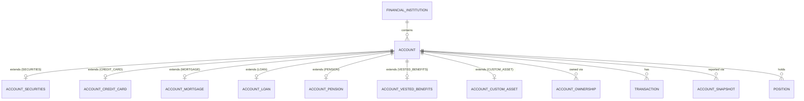

# TrackMyWealth — Database Schema Design

This document is the companion to the Flyway migrations under
`backend/src/main/resources/db/migration/`. It explains the shape of the schema and *why* it is
shaped that way; the migrations themselves carry the requirement-ID-level detail (grep them for
`FR-`, `DM-`, `RULE-` and `DB-` references back to the requirements documents in the project). It
also satisfies **FR-POR-003** — schema documentation sufficient for the statutory-portability
extraction described in section 31 to be performed reliably.

Source documents: `requirements-personal-wealth-platform.md` and
`TrackMyWealth_Consolidated_Requirements_Specification_v5.docx` (both in the project's knowledge
base). Requirement IDs below refer to the consolidated v5 specification unless noted otherwise.

## 1. Design principles carried through every table

| Principle | Where it comes from | How it shows up in the schema |
|---|---|---|
| Money is never a float | DB-01, NFR-CALC-001, NFR-TEC-001 | `NUMERIC(20,4)` for amounts, `NUMERIC(28,10)` for quantities, everywhere, no exceptions |
| Class-table inheritance, never `INHERITS` | DM-18, DB-09/DB-13 | `account` is the abstract parent; `account_credit_card`, `account_mortgage`, `account_pension`, etc. are extension tables sharing its PK |
| Behaviour varies by capability, not by subtype | FR-ACC-010/011 | Boolean capability flags on `account` (`holds_positions`, `is_discretionary`, ...) rather than ever-deeper subtypes |
| The ledger is append-only | RULE-024, FR-TRX-007 | `transaction` has a `BEFORE UPDATE` trigger that rejects any change to a financial field; corrections are void-and-replace |
| A Snapshot and a Transaction are different things | RULE-025, FR-REC-001 | `account_snapshot`/`snapshot_holding` vs `transaction` are separate tables; `reconciliation_result` compares the two |
| Everything derived is rebuildable from source | FR-DAT-008 | `position`, `tax_lot`, `daily_valuation` are all documented as rebuild targets, never written to directly by an API request |
| Tenant isolation is enforced in the database | FR-TEN-003 | PostgreSQL row-level security on every workspace-scoped table (`V20`), not just service-layer filtering |
| A user override is never silently overwritten | RULE-031 | Provenance tables (`security_field_provenance`, `transaction_categorization_log`) record `is_user_override` and the refresh jobs must check it |
| Estimates are always visibly marked | PR-011 | `is_estimated` columns on `position`, `daily_valuation`, `security_asset_class_weight`, `tax_lot`, `snapshot_holding` |

## 2. Migration index

| File | Contents |
|---|---|
| `V1` | Extensions, `updated_at`/optimistic-locking trigger helpers |
| `V2` | `workspace`, `workspace_member`, `app_user` (System User vs Workspace Member, RULE-018) |
| `V3` | `institution_catalogue` (shared seed data) and `financial_institution` (the container) |
| `V4` | `account` — the class-table-inheritance parent, capability flags, generated `nature` column |
| `V5` | Account subtype extension tables: securities, credit card, mortgage, loan, pension, vested benefits, custom asset |
| `V6` | `account_ownership` (dated, fractional) and `sharing_grant` (explicit, revocable) |
| `V7` | Security Master: `issuer`, `security`, `security_identifier`, `security_asset_class_weight`, provenance and per-workspace overrides |
| `V8` | `listing` (Security ≠ Listing, DM-26), `price` and `fx_rate` — both range-partitioned by date |
| `V9` | `corporate_action` and successor linkage |
| `V10` | `transaction` — the append-only ledger, with an idempotency unique index and a split-category table |
| `V11` | `account_snapshot`, `snapshot_holding`, `reconciliation_result`, `tax_lot`/`tax_lot_disposal`, `daily_valuation` (partitioned) |
| `V12` | `position` (current) and `position_history` (time series) |
| `V13` | Three-layer categorization: `category`, `category_source_mapping`, `categorization_rule`, `transaction_categorization_log` |
| `V14` | `budget`/`budget_line`, `savings_rate_methodology`, `goal`, `pension_contribution_tracking` |
| `V15` | Template-driven import framework: `import_template`, `import_batch`, `import_row_raw` |
| `V16` | `refresh_token`, `user_session`, `authorization_denial_log` |
| `V17` | `financial_audit_log`, `admin_audit_log`, `auth_audit_log` — three separate audit surfaces by design |
| `V18` | `reference_package`, `pension_scheme_rule`, `gics_structure_version`, `fallback_sector_taxonomy`, `trading_calendar` |
| `V19` | Baseline reference-data seed (categories, institution catalogue, fallback taxonomy) — **must run before V20** |
| `V20` | Row-level security: `current_workspace_id()`, per-table policies, the workspace bootstrap sequence |
| `V21` | Fixes `trg_transaction_append_only` (V10) to also cover `fee_amount`/`fx_rate_to_account_currency`/`fx_rate_date`, which the original trigger omitted |
| `V90` | Quartz job-store schema (framework-owned, deliberately gapped — see "Migration numbering and out-of-order application" below) |

All twenty of the original migrations have been applied end-to-end against a real PostgreSQL 16
instance as part of this design (including a positive/negative row-level-security test as a
non-superuser role); see the commit history for the fixes that came out of that pass
(reserved-word collision on `system_user`, partitioned-table primary key rules for
`price`/`fx_rate`/`daily_valuation`).

### Migration numbering and out-of-order application

`V90` (Quartz's own job-store schema) is deliberately numbered far above the domain migrations so
it reads as visually distinct framework-owned schema rather than another `V21`, `V22`, ... in the
same sequence as `workspace`/`account`/`transaction`. That only works because
`spring.flyway.out-of-order` is `true` (`application.yml`): once `V90` has been applied to a
database, Flyway's default (`out-of-order: false`) would refuse every subsequent domain migration
numbered below it (`V21`-`V89`) as "not applied in order." `V21` (the append-only trigger fix
below) is what surfaced this — it was rejected on a database that already had `V90` applied until
`out-of-order` was turned on. This is safe here because `V21` and `V90` touch disjoint,
independent parts of the schema (the transaction ledger vs. Quartz's tables); it would not
automatically be safe for two migrations that *do* depend on each other's ordering, so don't reach
for `out-of-order` reflexively when adding a future migration in this range - the pairing has to
be independent for it to be sound.

## 3. The account hierarchy (class-table inheritance)

Every subtype-specific table's primary key is also a foreign key to `account(id)`, which
structurally enforces "at most one extension row per account" (G2, disjoint specialisation) —
there is no way in SQL to attach two different extension rows to the same account. A
`trg_extension_type_guard` trigger additionally stops a `CREDIT_CARD` account from acquiring a
`account_mortgage` row by mistake. `account_type` itself is frozen after creation by
`trg_account_type_immutable` (FR-ACC-005/G5).

`nature` (`ASSET`/`LIABILITY`) is a PostgreSQL `GENERATED ALWAYS AS` column derived from
`account_type` (DB-12) — no application code path can write an inconsistent sign, which is the
specific bug DM-12 calls out ("a mortgage being added to rather than subtracted from net worth").

## 4. Tenancy enforcement

The isolation boundary is the workspace (FR-TEN-001). Every workspace-scoped table carries a
`workspace_id` column and a row-level-security policy comparing it to a PostgreSQL session
variable, `app.current_workspace_id`, set once per request/transaction by the application via
`SELECT set_config('app.current_workspace_id', ?, true)` — the `true` (is_local) argument scopes
it to the current transaction, so it can never leak across two requests sharing a pooled
connection. `FORCE ROW LEVEL SECURITY` is set on every one of those tables so that even an
elevated database role is bound by policy (NFR-DEP-004 — a deployment believed to have one
workspace is not permitted to relax any control).

The actual mechanism is `com.trackmywealth.backend.config.WorkspaceContextTransactionExecutionListener`
(US-28-01, see `docs/architecture/adr/0002-workspace-context-propagation.md`) — `V20__tenancy_row_level_security.sql`'s
own header comment now names it directly (originally a placeholder forward-reference predating the
class's own implementation, corrected in place under the household→workspace rename's one-time
exception to the "never edit an applied migration" rule - see `development-standards.md`).

Tables that hang off a workspace-scoped table but do not carry `workspace_id` directly
(`account_credit_card`, `tax_lot`, `price`, `snapshot_holding`, ...) are protected **transitively**
through a join to `account`/`security`/`account_snapshot`. `security`, `listing`, `price`,
`fx_rate`, `issuer`, `institution_catalogue` and the reference-data tables in `V18` carry **no**
`workspace_id` at all and are **not** RLS-protected — this is deliberate: they are shared,
global reference data (DM-25, NFR-LIC-006/007), not tenant data.

**Production hardening not yet wired up:** this scaffold runs migrations and the application
under the same database role for local-development simplicity. Before a multi-workspace hosted
deployment goes live, split this into a migration-owner role (used only by Flyway, at deploy
time) and a `NOSUPERUSER`, non-owner runtime role (used only by the running application, granted
`SELECT/INSERT/UPDATE/DELETE` but not `CREATEDB`/`ALTER`) — the commented-out template at the
bottom of `V20__tenancy_row_level_security.sql` is the starting point. `FR-TEN-010` requires an
automated cross-tenant test suite that attempts unauthorized access against every endpoint and
entity type in CI; write it against that runtime role, not the migration role, or it will pass
for the wrong reason (superusers bypass RLS unconditionally).

### Security master: lazy creation and manual mode (US-12-01)

`security` is created only when a workspace first references an instrument (FR-SMD-001) and is
shared afterwards (FR-SMD-004). `POST /api/v1/securities` finds or creates by ISIN;
`GET /api/v1/securities?isin=` looks up without ever writing (FR-SMD-007), and
`GET /api/v1/securities/{id}` is the only way to find a security that has no ISIN. There is
deliberately no search or listing of the shared master: a hand-entered private holding must not be
discoverable by another workspace. Rules that follow from the table being global, unscoped data:

- **Existing wins, visibly.** A second caller supplying a different name, currency or type for a
  known ISIN gets the existing row back unchanged, with an `X-Security-Ignored-Fields` header
  naming which supplied values differed (absent when nothing differed). Shared rows are never
  edited by a caller. A workspace-specific change is an override
  (`workspace_security_override`, US-12-04); note that a wrong `denominationCurrency` or
  `instrumentType` on the shared row therefore cannot be corrected by the workspace that
  introduced it, only overridden per workspace - US-12-04 must cover those fields.
- **No tenant traces.** Neither the row nor its `security_field_provenance` names the workspace or
  user that caused it to exist; a hand-entered value has source `MANUAL` (NFR-LIC-007).
- **Race-safe.** Creation is `INSERT ... ON CONFLICT DO NOTHING`, so two workspaces creating the
  same new ISIN at once yield one row (a caught unique violation would abort the PostgreSQL
  transaction).
- **Retry-safe without an ISIN.** An optional `idempotencyKey` makes a no-ISIN create safe to
  retry. It is stored only as a SHA-256 of workspace id and key inside the synthetic key
  (`MANUAL-<hex>`), so it is not recoverable and never collides across workspaces. Without a key
  every call creates a new record (`MANUAL-<uuid>`). A key together with an ISIN is a 422.
- **Who may create.** EDIT on at least one active account in the caller's workspace, and at most
  `app.rate-limit.security-create` requests per source (default 30/min), since every insert is
  visible to every tenant. Lookups are not rate-limited by this rule.
- **Manual mode is the supported baseline** (NFR-LIC-004/008, NFR-CON-004): no external
  reference-data provider is configured (OPEN-005), so a record is entered by hand (name,
  denomination currency, instrument type, asset class; ISIN optional and check-digit validated).
  The asset class is stored as one 100% `security_asset_class_weight` row flagged estimated.
  `legalName` is optional; when omitted it is set to the display name and its provenance
  confidence is `DERIVED`. Downstream code cannot tell such a record from a provider-fed one.
- **Completeness (FR-SMD-011).** The response lists the analysis-relevant fields still missing
  (`securityCountry`, `issuerCountry`, and `gicsSubIndustry` for equity instruments). Until a
  story can set a GICS code, a manual equity is always reported incomplete on `gicsSubIndustry` -
  that is the honest state, not an error.
- **Vocabulary.** `V32` adds a `CHECK` on `security.instrument_type` (EQUITY, ETF, FUND, BOND,
  CRYPTO, DERIVATIVE, OTHER; NULL allowed) so no other writer can put an unrecognised value into
  shared data. `CRYPTO` (an instrument type) and `CRYPTOCURRENCY` (an asset class) are different
  vocabularies on purpose; adding a type is a one-line migration.

### Snapshots: manual entry (US-25-01)

`POST /api/v1/accounts/{id}/snapshots` records a statement balance, and for an account that
`holds_positions` its per-security quantities, as a `MANUAL` `account_snapshot` with
`snapshot_holding` rows (FR-REC-006). It never touches the ledger (RULE-025).

- **Currency and sign.** A snapshot is always in the account's `native_currency` (not client
  input; `V33` guards it), and its balance uses the same convention as the ledger-derived balance
  (a liability's balance is the positive amount owed), so US-25-02 can compare the two directly.
  `reported_cost_basis` is a total in that same currency.
- **Holdings** reference existing security-master ids only (create first via `POST
  /api/v1/securities`), at most once per snapshot (`V33`'s `uq_snapshot_holding_security`). A
  balance may be omitted only when holdings are given.
- **Duplicates and corrections.** A second `MANUAL` snapshot for the same account and date is a
  409 carrying `existingSnapshotId`; `PUT .../snapshots/{snapshotId}` replaces a `MANUAL`
  snapshot's balance and holdings and sets `updated_at`/`updated_by` (`V33`). Snapshots from any
  other source are never edited through the API.
- **Isolation.** `account_snapshot` is RLS-protected; `snapshot_holding` is not and is only read
  by the id of a snapshot already loaded under that policy.

### Category taxonomy: shared defaults, workspace customisation (US-08-04)

`/api/v1/categories` manages a workspace's reporting taxonomy: the shipped defaults
(`workspace_id IS NULL`, `V19`) plus the workspace's own categories. Decisions are recorded on
issue #144.

- **Defaults are never edited by a workspace.** V20's RLS rejects the write anyway, and editing the
  shared row would change it for everyone. Relabelling or deactivating a default is stored per
  workspace in `workspace_category_override` (`V34`; a NULL column inherits the shipped value, and
  an override that overrides nothing is deleted). It is a user customisation a reference package
  must not overwrite (FR-REF-009). Defaults keep their shipped position; only workspace categories
  can be moved.
- **Codes.** Reports key on `code`, never on a label (FR-CAT-008). Workspace codes are generated
  from the English label, immutable, and carry a `WS_` prefix that defaults never use
  (`category_code_namespace`), so a future default cannot collide with a workspace code. `V34`
  also replaces V13's `UNIQUE (workspace_id, code)`, which let two defaults share a code (NULLs are
  distinct), with `uq_category_workspace_code ... NULLS NOT DISTINCT`.
- **Service-layer rules** (`CategoryService`): at most 3 levels (a move checks the moved subtree's
  height) and no cycles; EN and DE labels unique among siblings, ignoring case; deactivation
  cascades to every subcategory, while reactivation affects one category and needs an active
  parent; `UNCATEGORIZED` and `TRANSFER_INTERNAL` can never be deactivated, deleted or given
  subcategories. `requireAssignable` is the single check later stories (US-08-01/02) call before
  assigning a category: an inactive one is a 422.
- **Deletion (FR-LIF-001).** A default is never hard-deleted (409, deactivate instead). A
  workspace category is deleted only if no transaction, split, rule, source mapping, budget line,
  categorization-log entry or subcategory refers to it; the foreign keys are the backstop for a
  reference the workspace cannot see.
- **Isolation.** `workspace_category_override` is RLS-protected like any tenant table.
  `category_parent_scope_guard` stops a category being placed under another workspace's category,
  which the foreign key alone would allow, since FK checks bypass RLS.
- **Access.** Any workspace member may read; changes need EDIT on the workspace, because the
  taxonomy shapes every member's reports.

## 5. Time-series data and partitioning

`price`, `fx_rate` and `daily_valuation` are the volume-dominant tables (DB-02, NFR-TEC-003) and
are all `PARTITION BY RANGE` on their date column, with explicit yearly partitions for
2023–2027 and a `DEFAULT` catch-all partition so an out-of-range insert never fails outright.
**Operational note:** add a new year's partition (`CREATE TABLE price_y2028 PARTITION OF price
FOR VALUES FROM ('2028-01-01') TO ('2029-01-01');`, and the equivalent for `fx_rate` and
`daily_valuation`) via a normal numbered migration before each table's `DEFAULT` partition
accumulates a meaningful volume of rows — rows can be moved out of `DEFAULT` into a proper
partition later, but it is cheaper to stay ahead of it. A scheduled job (EPIC 30/31) should alert
when any of the three `_default` partitions is non-empty.

PostgreSQL requires every `PRIMARY KEY`/`UNIQUE` constraint on a partitioned table to include the
partition key column. `price` and `fx_rate` therefore use a composite `(id, price_date)` /
`(id, rate_date)` primary key rather than `id` alone; `daily_valuation`'s natural key
`(account_id, valuation_date)` already satisfies this. This is a partitioning artifact, not a
modelling decision — application code should still treat `id` as the row's identity where it is
usable (i.e. everywhere except the small number of write paths that need the composite key).

## 6. What is deliberately not fully implemented yet

This schema covers the MVP baseline (section 37 of the specification) as agreed for the epics
listed in `docs/user-stories/`. Explicitly deferred, consistent with the specification's own
Post-MVP list (section 38) and open decisions (section 42):

- **SNB classification** (`security.snb_institutional_sector_code`/`snb_securities_category_code`)
  is present as free-text columns pending **OPEN-007/D12** (exact SNB taxonomy TBD).
- **GICS/constituent look-through data licensing** (OPEN-006/OPEN-019) — the schema supports it
  (`gics_sub_industry_code`, `fallback_sector_taxonomy`) but no license is assumed.
- **Workspace splitting** (section 53) is not built, but `account_ownership`/`sharing_grant` are
  already dated relations rather than static columns specifically so it can be added later
  without rewriting history (FR-HHL-001..005).
- **User-facing data export** (OOS-008) is out of scope per the specification; the schema
  satisfies FR-DAT-008 (everything derived is rebuildable from source) so it costs nothing to add
  later if that decision reverses (OPEN-031).
- A dedicated `refresh_token`/`user_session` pair exists (V16) but the Spring Security
  configuration, JWT filter chain and password-hashing service that consume them are **not**
  implemented in this scaffold — see `docs/user-stories/EPIC-02-user-administration-and-auth.md`
  and `EPIC-28-tenancy-authentication-authorization.md` for the corresponding developer stories.
