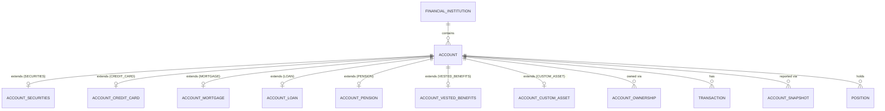

# TrackMyWealth — Database Schema Design

This document is the companion to the Flyway migrations under
`backend/src/main/resources/db/migration/`. It explains the shape of the schema and *why* it is
shaped that way; the migrations themselves carry the requirement-ID-level detail (grep them for
`FR-`, `DM-`, `RULE-` and `DB-` references back to the requirements documents in the project). It
also satisfies **FR-POR-003** — schema documentation sufficient for the statutory-portability
extraction described in section 31 to be performed reliably.

Source documents: `requirements-personal-wealth-platform.md` and
`TrackMyWealth_Consolidated_Requirements_Specification_v5.docx` (both in the project's knowledge
base). Requirement IDs below refer to the consolidated v5 specification unless noted otherwise.

## 1. Design principles carried through every table

| Principle | Where it comes from | How it shows up in the schema |
|---|---|---|
| Money is never a float | DB-01, NFR-CALC-001, NFR-TEC-001 | `NUMERIC(20,4)` for amounts, `NUMERIC(28,10)` for quantities, everywhere, no exceptions |
| Class-table inheritance, never `INHERITS` | DM-18, DB-09/DB-13 | `account` is the abstract parent; `account_credit_card`, `account_mortgage`, `account_pension`, etc. are extension tables sharing its PK |
| Behaviour varies by capability, not by subtype | FR-ACC-010/011 | Boolean capability flags on `account` (`holds_positions`, `is_discretionary`, ...) rather than ever-deeper subtypes |
| The ledger is append-only | RULE-024, FR-TRX-007 | `transaction` has a `BEFORE UPDATE` trigger that rejects any change to a financial field; corrections are void-and-replace |
| A Snapshot and a Transaction are different things | RULE-025, FR-REC-001 | `account_snapshot`/`snapshot_holding` vs `transaction` are separate tables; `reconciliation_result` compares the two |
| Everything derived is rebuildable from source | FR-DAT-008 | `position`, `tax_lot`, `daily_valuation` are all documented as rebuild targets, never written to directly by an API request |
| Tenant isolation is enforced in the database | FR-TEN-003 | PostgreSQL row-level security on every workspace-scoped table (`V20`), not just service-layer filtering |
| A user override is never silently overwritten | RULE-031 | Provenance tables (`security_field_provenance`, `transaction_categorization_log`) record `is_user_override` and the refresh jobs must check it |
| Estimates are always visibly marked | PR-011 | `is_estimated` columns on `position`, `daily_valuation`, `security_asset_class_weight`, `tax_lot`, `snapshot_holding` |

## 2. Migration index

| File | Contents |
|---|---|
| `V1` | Extensions, `updated_at`/optimistic-locking trigger helpers |
| `V2` | `workspace`, `workspace_member`, `app_user` (System User vs Workspace Member, RULE-018) |
| `V3` | `institution_catalogue` (shared seed data) and `financial_institution` (the container) |
| `V4` | `account` — the class-table-inheritance parent, capability flags, generated `nature` column |
| `V5` | Account subtype extension tables: securities, credit card, mortgage, loan, pension, vested benefits, custom asset |
| `V6` | `account_ownership` (dated, fractional) and `sharing_grant` (explicit, revocable) |
| `V7` | Security Master: `issuer`, `security`, `security_identifier`, `security_asset_class_weight`, provenance and per-workspace overrides |
| `V8` | `listing` (Security ≠ Listing, DM-26), `price` and `fx_rate` — both range-partitioned by date |
| `V9` | `corporate_action` and successor linkage |
| `V10` | `transaction` — the append-only ledger, with an idempotency unique index and a split-category table |
| `V11` | `account_snapshot`, `snapshot_holding`, `reconciliation_result`, `tax_lot`/`tax_lot_disposal`, `daily_valuation` (partitioned) |
| `V12` | `position` (current) and `position_history` (time series) |
| `V13` | Three-layer categorization: `category`, `category_source_mapping`, `categorization_rule`, `transaction_categorization_log` |
| `V14` | `budget`/`budget_line`, `savings_rate_methodology`, `goal`, `pension_contribution_tracking` |
| `V15` | Template-driven import framework: `import_template`, `import_batch`, `import_row_raw` |
| `V16` | `refresh_token`, `user_session`, `authorization_denial_log` |
| `V17` | `financial_audit_log`, `admin_audit_log`, `auth_audit_log` — three separate audit surfaces by design |
| `V18` | `reference_package`, `pension_scheme_rule`, `gics_structure_version`, `fallback_sector_taxonomy`, `trading_calendar` |
| `V19` | Baseline reference-data seed (categories, institution catalogue, fallback taxonomy) — **must run before V20** |
| `V20` | Row-level security: `current_workspace_id()`, per-table policies, the workspace bootstrap sequence |
| `V21` | Fixes `trg_transaction_append_only` (V10) to also cover `fee_amount`/`fx_rate_to_account_currency`/`fx_rate_date`, which the original trigger omitted |
| `V47` | Bounds `authorization_denial_log`: `RATE_LIMITED` summary reason, `suppressed_count`, retention index (#205) |
| `V48` | Adds optimistic-concurrency revisions to remaining mutable API resources (#207) |
| `V49` | Adds immutable `corrects_transaction_id` lineage for transaction corrections (#178) |
| `V50` | Adds immutable `restores_transaction_id` lineage for restoring a void (#179) |
| `V90` | Quartz job-store schema (framework-owned, deliberately gapped — see "Migration numbering and out-of-order application" below) |

All twenty of the original migrations have been applied end-to-end against a real PostgreSQL 16
instance as part of this design (including a positive/negative row-level-security test as a
non-superuser role); see the commit history for the fixes that came out of that pass
(reserved-word collision on `system_user`, partitioned-table primary key rules for
`price`/`fx_rate`/`daily_valuation`).

### Migration numbering and out-of-order application

`V90` (Quartz's own job-store schema) is deliberately numbered far above the domain migrations so
it reads as visually distinct framework-owned schema rather than another `V21`, `V22`, ... in the
same sequence as `workspace`/`account`/`transaction`. That only works because
`spring.flyway.out-of-order` is `true` (`application.yml`): once `V90` has been applied to a
database, Flyway's default (`out-of-order: false`) would refuse every subsequent domain migration
numbered below it (`V21`-`V89`) as "not applied in order." `V21` (the append-only trigger fix
below) is what surfaced this — it was rejected on a database that already had `V90` applied until
`out-of-order` was turned on. This is safe here because `V21` and `V90` touch disjoint,
independent parts of the schema (the transaction ledger vs. Quartz's tables); it would not
automatically be safe for two migrations that *do* depend on each other's ordering, so don't reach
for `out-of-order` reflexively when adding a future migration in this range - the pairing has to
be independent for it to be sound.

## 3. The account hierarchy (class-table inheritance)

Every subtype-specific table's primary key is also a foreign key to `account(id)`, which
structurally enforces "at most one extension row per account" (G2, disjoint specialisation) —
there is no way in SQL to attach two different extension rows to the same account. A
`trg_extension_type_guard` trigger additionally stops a `CREDIT_CARD` account from acquiring a
`account_mortgage` row by mistake. `account_type` itself is frozen after creation by
`trg_account_type_immutable` (FR-ACC-005/G5).

`nature` (`ASSET`/`LIABILITY`) is a PostgreSQL `GENERATED ALWAYS AS` column derived from
`account_type` (DB-12) — no application code path can write an inconsistent sign, which is the
specific bug DM-12 calls out ("a mortgage being added to rather than subtracted from net worth").

## 4. Tenancy enforcement

The isolation boundary is the workspace (FR-TEN-001). Every workspace-scoped table carries a
`workspace_id` column and a row-level-security policy comparing it to a PostgreSQL session
variable, `app.current_workspace_id`, set once per request/transaction by the application via
`SELECT set_config('app.current_workspace_id', ?, true)` — the `true` (is_local) argument scopes
it to the current transaction, so it can never leak across two requests sharing a pooled
connection. `FORCE ROW LEVEL SECURITY` is set on every one of those tables so that even an
elevated database role is bound by policy (NFR-DEP-004 — a deployment believed to have one
workspace is not permitted to relax any control).

The actual mechanism is `com.trackmywealth.backend.config.WorkspaceContextTransactionExecutionListener`
(US-28-01, see `docs/architecture/adr/0002-workspace-context-propagation.md`) — `V20__tenancy_row_level_security.sql`'s
own header comment now names it directly (originally a placeholder forward-reference predating the
class's own implementation, corrected in place under the household→workspace rename's one-time
exception to the "never edit an applied migration" rule - see `development-standards.md`).

Tables that hang off a workspace-scoped table but do not carry `workspace_id` directly
(`account_credit_card`, `tax_lot`, `price`, `snapshot_holding`, ...) are protected **transitively**
through a join to `account`/`security`/`account_snapshot`. `security`, `listing`, `price`,
`fx_rate`, `issuer`, `institution_catalogue` and the reference-data tables in `V18` carry **no**
`workspace_id` at all and are **not** RLS-protected — this is deliberate: they are shared,
global reference data (DM-25, NFR-LIC-006/007), not tenant data.

**Production hardening not yet wired up:** the application runs migrations and its own queries
under the same database role for local-development simplicity. Before a multi-workspace hosted
deployment goes live, split this into a migration-owner role (used only by Flyway, at deploy
time) and a `NOSUPERUSER`, non-owner runtime role (used only by the running application, granted
`SELECT/INSERT/UPDATE/DELETE` but not `CREATEDB`/`ALTER`) — the commented-out template at the
bottom of `V20__tenancy_row_level_security.sql` is the starting point. `FR-TEN-010` requires an
automated cross-tenant test suite that attempts unauthorized access against every endpoint and
entity type in CI; write it against that runtime role, not the migration role, or it will pass
for the wrong reason (superusers bypass RLS unconditionally).

### Object-level denial audit lifecycle (US-28-02, #205)

Every audited single-resource denial still returns the same generic 404 and records only the
principal, requested entity type/id and a non-enumerating reason. An audit row the budget below
calls for is **never lost** (decided 2026-10-01): it is written synchronously, as one auto-committed
`INSERT`, before the 404 is returned, so it is durable and survives the request's rollback.

**Connections.** Rows are written through a small connection pool of its own
(`AuthorizationDenialAuditPool`, `audit-pool-size`, 2 by default), never the main pool. The earlier
nested `REQUIRES_NEW` write took its second connection from the main pool while the request still
held one, so enough concurrent denials could wait on each other until the pool timed out. An audit
connection is never held while waiting for a main-pool one, so that circular wait cannot occur.
The audit pool:

- starts from the main pool's `spring.datasource.hikari.*` settings (driver/SSL
  `data-source-properties`, lifetimes), so the database is configured once;
- is deliberately not a `DataSource` bean, which would make Spring Boot back off its own;
- publishes Hikari's Micrometer metrics under `pool=denial-audit` and has its own health check
  (`authorizationDenialAuditPool`);
- adds its connections on top of `DB_POOL_MAX`: size PostgreSQL's `max_connections` for
  `instances × (DB_POOL_MAX + audit-pool-size)`.

**Timeouts, and the one 500 (decided trade-off).** A denied request keeps its main-pool connection
while it writes the audit row, so the write is bounded twice: `audit-connection-timeout` (1s by
default; startup fails unless it is shorter than the main pool's `connection-timeout`) and
`audit-statement-timeout` (2s, cancels a hung `INSERT`; a socket timeout of twice that is the
backstop). If the row still cannot be written - audit pool exhausted beyond its timeout, statement
cancelled, database down - the request fails with a 500 instead of continuing without its audit
row. This deliberately deviates from #205's first acceptance criterion ("no 500"): never losing a
row was decided to outweigh it. It is identical whether the id exists or not, so it reveals
nothing, and in normal operation it does not occur: a burst of 50 concurrent denials against the
2-connection pool all complete as 404 (`AuthorizationDenialAuditTransactionTest`).

**Volume.** To prevent a signed-in caller from growing the table without bound, exact `NOT_FOUND`
rows are capped per principal and refill window (200 per hour by default). The first denial over
that budget writes one `RATE_LIMITED` summary row with no requested id; later denials in the same
window add no rows, but are counted. The principal's first denial after the window closes writes a
second `RATE_LIMITED` row whose `suppressed_count` says how many were suppressed, so the magnitude of
probing survives. A principal who doesn't return has the count written when its window is evicted
from the bounded, expiring in-memory cache, or at shutdown; only a crash, or a database failure at
that moment (logged with the count), can lose it - the window's first summary row is already
durable. The budget is in memory, so with several application instances each bound applies once per
instance. By default one principal can cause at most about 202 rows per hour per instance (about
436,000 over the 90-day retention).

**Retention.** `AuthorizationDenialAuditRetentionService` deletes rows older than
`app.authorization-denial-audit.retention` (90 days by default), every `cleanup-interval` (1 hour),
in batches of `cleanup-batch-size` (5,000) rows per transaction, using V47's `occurred_at` index.
Several instances running it at once is harmless. All of these values are deployment configuration
in `application.yml`.

### Security master: lazy creation and manual mode (US-12-01)

`security` is created only when a workspace first references an instrument (FR-SMD-001) and is
shared afterwards (FR-SMD-004). `POST /api/v1/securities` finds or creates by ISIN;
`GET /api/v1/securities?isin=` looks up without ever writing (FR-SMD-007), and
`GET /api/v1/securities/{id}` is the only way to find a security that has no ISIN. There is
deliberately no search or listing of the shared master: a hand-entered private holding must not be
discoverable by another workspace. Rules that follow from the table being global, unscoped data:

- **Existing wins, visibly.** A second caller supplying a different name, currency or type for a
  known ISIN gets the existing row back unchanged, with an `X-Security-Ignored-Fields` header
  naming which supplied values differed (absent when nothing differed). Shared rows are never
  edited by a caller. A workspace-specific change is an override
  (`workspace_security_override`, US-12-04); note that a wrong `denominationCurrency` or
  `instrumentType` on the shared row therefore cannot be corrected by the workspace that
  introduced it, only overridden per workspace - US-12-04 must cover those fields.
- **No tenant traces.** Neither the row nor its `security_field_provenance` names the workspace or
  user that caused it to exist; a hand-entered value has source `MANUAL` (NFR-LIC-007).
- **Race-safe.** Creation is `INSERT ... ON CONFLICT DO NOTHING`, so two workspaces creating the
  same new ISIN at once yield one row (a caught unique violation would abort the PostgreSQL
  transaction).
- **Retry-safe without an ISIN.** An optional `idempotencyKey` makes a no-ISIN create safe to
  retry. It is stored only as a SHA-256 of workspace id and key inside the synthetic key
  (`MANUAL-<hex>`), so it is not recoverable and never collides across workspaces. Without a key
  every call creates a new record (`MANUAL-<uuid>`). A key together with an ISIN is a 422.
- **Who may create.** EDIT on at least one active account in the caller's workspace, and at most
  `app.rate-limit.security-create` requests per source (default 30/min), since every insert is
  visible to every tenant. Lookups are not rate-limited by this rule.
- **Manual mode is the supported baseline** (NFR-LIC-004/008, NFR-CON-004): no external
  reference-data provider is configured (OPEN-005), so a record is entered by hand (name,
  denomination currency, instrument type, asset class; ISIN optional and check-digit validated).
  The asset class is stored as one 100% `security_asset_class_weight` row flagged estimated.
  `legalName` is optional; when omitted it is set to the display name and its provenance
  confidence is `DERIVED`. Downstream code cannot tell such a record from a provider-fed one.
- **Completeness (FR-SMD-011).** The response lists the analysis-relevant fields still missing
  (`securityCountry`, `issuerCountry`, and `gicsSubIndustry` for equity instruments). Until a
  story can set a GICS code, a manual equity is always reported incomplete on `gicsSubIndustry` -
  that is the honest state, not an error.
- **Vocabulary.** `V32` adds a `CHECK` on `security.instrument_type` (EQUITY, ETF, FUND, BOND,
  CRYPTO, DERIVATIVE, OTHER; NULL allowed) so no other writer can put an unrecognised value into
  shared data. `CRYPTO` (an instrument type) and `CRYPTOCURRENCY` (an asset class) are different
  vocabularies on purpose; adding a type is a one-line migration.

### Snapshots: manual entry (US-25-01)

`POST /api/v1/accounts/{id}/snapshots` records a statement balance, and for an account that
`holds_positions` its per-security quantities, as a `MANUAL` `account_snapshot` with
`snapshot_holding` rows (FR-REC-006). It never touches the ledger (RULE-025).

- **Currency and sign.** A snapshot is always in the account's `native_currency` (not client
  input; `V33` guards it), and its balance uses the same convention as the ledger-derived balance
  (a liability's balance is the positive amount owed), so US-25-02 can compare the two directly.
  `reported_cost_basis` is a total in that same currency.
- **Holdings** reference existing security-master ids only (create first via `POST
  /api/v1/securities`), at most once per snapshot (`V33`'s `uq_snapshot_holding_security`). A
  balance may be omitted only when holdings are given.
- **Duplicates and corrections.** A second `MANUAL` snapshot for the same account and date is a
  409 carrying `existingSnapshotId`; `PUT .../snapshots/{snapshotId}` replaces a `MANUAL`
  snapshot's balance and holdings and sets `updated_at`/`updated_by` (`V33`). Snapshots from any
  other source are never edited through the API.
- **Isolation.** `account_snapshot` is RLS-protected; `snapshot_holding` is not and is only read
  by the id of a snapshot already loaded under that policy.

### Category taxonomy: shared defaults, workspace customisation (US-08-04)

`/api/v1/categories` manages a workspace's reporting taxonomy: the shipped defaults
(`workspace_id IS NULL`, `V19`) plus the workspace's own categories. Decisions are recorded on
issue #144.

- **Defaults are never edited by a workspace.** V20's RLS rejects the write anyway, and editing the
  shared row would change it for everyone. Relabelling or deactivating a default is stored per
  workspace in `workspace_category_override` (`V34`; a NULL column inherits the shipped value, and
  an override that overrides nothing is deleted). It is a user customisation a reference package
  must not overwrite (FR-REF-009). Defaults keep their shipped position; only workspace categories
  can be moved.
- **Codes.** Reports key on `code`, never on a label (FR-CAT-008). Workspace codes are generated
  from the English label, immutable, and carry a `WS_` prefix that defaults never use
  (`category_code_namespace`), so a future default cannot collide with a workspace code. `V34`
  also replaces V13's `UNIQUE (workspace_id, code)`, which let two defaults share a code (NULLs are
  distinct), with `uq_category_workspace_code ... NULLS NOT DISTINCT`.
- **Database label/default integrity.** `V46` mirrors the API's 100-character category-label
  limit at the database boundary for both `category` and `workspace_category_override`, rejects
  blank-after-trim labels, and enforces `(workspace_id IS NULL) = is_system_default`. This keeps
  reference-package/import/script writers aligned with the DTO contract and prevents the API's
  derived `systemDefault` flag from disagreeing with stored data. "Blank" covers tabs and line
  breaks as well as spaces, as `@NotBlank` does. Two first overrides of the same shipped default
  cannot race through `CategoryService`, which locks the workspace row before reading overrides;
  should a writer that bypasses that lock ever hit `uq_workspace_category_override`, the answer is
  a retryable 409 (`RETRY`) rather than a generic constraint conflict.
- **Service-layer rules** (`CategoryService`): at most 3 levels (a move checks the moved subtree's
  height) and no cycles; EN and DE labels unique among siblings, ignoring case; deactivation
  cascades to every subcategory, while reactivation affects one category and needs an active
  parent; `UNCATEGORIZED` and `TRANSFER_INTERNAL` can never be deactivated, deleted or given
  subcategories. A category counts as active only if every ancestor is active too, so a default a
  later reference package adds under a deactivated default is inactive as well. `requireAssignable`
  is the single check later stories (US-08-01/02) call before assigning a category: an inactive
  one is a 422. It has a batch form that loads the taxonomy once, for bulk categorization.
- **Concurrency.** Every change locks the workspace row (`SELECT ... FOR UPDATE`) before reading
  the tree, so two changes to one workspace's taxonomy run one after the other. The depth, cycle
  and sibling-label rules are checked in memory and no constraint backs them, so without the lock
  two concurrent moves could form a cycle. `PUT` also carries the `version` the client last read
  and is a 409 if the category changed since. For a default, that token tracks the workspace's
  override.
- **Deletion (FR-LIF-001).** A default is never hard-deleted (409, deactivate instead). A
  workspace category is deleted only if no transaction, split, rule, source mapping, budget line,
  categorization-log entry or subcategory refers to it; the foreign keys are the backstop for a
  reference the workspace cannot see.
- **Isolation.** `workspace_category_override` is RLS-protected like any tenant table. Its
  foreign keys cascade (`V35`), so an override goes with its workspace or with a retired default.
  `category_parent_scope_guard` stops a category being placed under another workspace's category,
  which the foreign key alone would allow, since FK checks bypass RLS.
- **Access.** Any workspace member may read; changes need EDIT on the workspace, because the
  taxonomy shapes every member's reports. Each response carries `canEdit`, so a client can hide
  the actions that would be refused.

### Automatic categorization (US-08-01)

`CategorizationService` assigns a category to every new cash or card row (`INCOME`, `EXPENSE`,
`DEPOSIT`, `WITHDRAWAL`, `INTEREST`, `FEE`, `TAX`, `REFUND`, `CREDIT_CARD_PURCHASE`) in the same
transaction that records it. `SETTLEMENT` and investment types get no category. Decisions are on
issue #145.

- **Layers, first assignable hit wins.** The layers run in this order:
  1. The workspace's active `categorization_rule`s, lowest `priority` first. `MERCHANT` is a
     case-insensitive "contains" on the merchant description; `SOURCE_CODE` is an exact code such
     as `MCC:5812`.
  2. The shipped `category_source_mapping`, trying ISO 20022 purpose, then bank transaction code,
     then MCC.
  3. `TRANSACTION_TYPE`: the category a row's own type implies, `FEE` to `FEES` and `TAX` to
     `TAXES`. This is where a card's foreign-transaction fee row lands, since it has no merchant
     or code of its own.
  4. `FALLBACK_MATCH`: the most pg_trgm-similar earlier row of the workspace whose category a
     rule or a user assigned, at or above `app.categorization.fuzzy-similarity-threshold`. It must
     share the merchant's brand word, because a shared city name alone is as similar as a shared
     brand. The query filters with pg_trgm's `%` operator, which V10's GIN trigram index serves
     (`similarity() >= t` alone scans the workspace's whole history). The threshold for `%` is set
     with `set_config(..., true)`, for the current transaction only, so it never outlives the
     request on a pooled connection.
  5. `UNCATEGORIZED`.

  A candidate whose category is inactive for the workspace (itself or an ancestor) is skipped.
  `categorizeAll` categorizes many rows (an import) against one load of each workspace's
  taxonomy, rules and shipped defaults, and resolves each distinct source code once.
- **Source codes** are read from `raw_source_data`: `mcc`, `purposeCode` and `bankTransactionCode`
  (`DOMAIN-FAMILY-SUBFAMILY`), the keys a camt import must write.
- **Provenance.** Every assignment writes a `transaction_categorization_log` row (`rule_id` for a
  rule, `confidence` for a fuzzy match). `UNCATEGORIZED` gets none, because nothing assigned it.
  Responses carry `categoryId` and `categoryAssignedBy`.
  `GET /accounts/{id}/transactions?uncategorized=true` is the actionable list (FR-CAT-013).
- **Rules** (`/api/v1/categorization-rules`): create, list and deactivate. Reading needs
  membership; changes need EDIT on the workspace. A rule is never edited, so its log rows keep
  their meaning. A `MERCHANT` value needs at least three characters, since a shorter "contains"
  would match almost every merchant. `COUNTERPARTY_IBAN` and `AMOUNT_PATTERN` are rejected until
  imports supply that data.
- **User override (US-08-02, RULE-031).** `PUT /accounts/{id}/transactions/{txId}/category` sets
  a member's own category, logged as `USER` with `is_user_override`. `DELETE` on the same path
  resets it to automatic and re-categorizes at once. Both need EDIT on the account. Any type may be
  overridden, to any assignable category except `UNCATEGORIZED`; voided rows cannot be changed.
  Every automatic path, including the internal `CategorizationService.recategorizeWorkspace`,
  skips an overridden row. The log row names the member who made the override
  (`assigned_by_user_id`, `V38`; required when `is_user_override`, `NULL` for automatic rows).
- **Override against a concurrent re-run.** The override and reset lock their row
  (`SELECT ... FOR UPDATE`) before checking it, and the re-run locks each page of rows before it
  checks them for overrides. Whichever comes second sees what the first committed, so a re-run can
  never write over an override made between its check and its write.
- **Re-run.** `recategorizeWorkspace` walks the workspace in keyset pages of 500 rows by
  `(created_at, id)`, clearing the persistence context after each page, so neither memory nor the
  override check's `IN` list grows with the workspace. A single unbounded list fails above 65,535
  rows. It writes a row only when its assignment changes: another category, or the same category
  reached another way (e.g. a rule instead of a fuzzy guess, or another rule). An unchanged
  decision writes nothing, so repeated runs don't grow the log.
- **Reading the log.** A transaction's latest log row describes its category only while the two
  still match: a reset that lands in `UNCATEGORIZED`, or a type the engine doesn't categorize,
  writes no row of its own. Responses, the override guard and the fuzzy matcher's learning query
  all apply that rule.
- **`V37`** adds the defaults `LEISURE > DINING`, `LEISURE > TRAVEL`, `HOUSING > UTILITIES`,
  `HEALTH`, `SHOPPING`, `TAXES` and `FEES`, and seeds 43 MCC and purpose-code mappings
  (FR-CAT-010: configuration, extendable by a reference package). It adds `TRANSACTION_TYPE` to
  the log's provenance values. It also backfills existing cash and card rows: the mapped MCC where
  assignable, else the type's category for a `FEE` or `TAX`, else `UNCATEGORIZED`. The backfill sets
  `row_security = off`, so a migration role that cannot bypass RLS fails loudly instead of
  updating nothing.

### Internal transfers and cash flow (US-10-01)

A transfer between two of a workspace's own accounts is never income or spending (FR-CF-001/002,
DM-05). Decisions are on issue #147.

- **Recorded as a pair.** A `TRANSFER` or `PENSION_CONTRIBUTION` with a `counterpartyAccountId`
  writes both legs at once, each in its own account's currency, both flagged `is_internal_transfer`
  and pointing at each other's account. The incoming leg links to the outgoing one through
  `related_transaction_id`. Removing or restoring either leg takes the other along (US-07-02), and
  either way the member needs EDIT on both accounts.
- **Matched when recorded separately.** `TransferDetectionService` pairs a negative
  TRANSFER/WITHDRAWAL/EXPENSE with a positive TRANSFER/DEPOSIT/INCOME on another own account: same
  currency, exact amount, at most 5 days apart. Card accounts are excluded, since cards settle
  through US-09-02. Matches reuse `settlement_match` with `match_kind = 'TRANSFER'` (`V41`): the
  debit is the "payment" leg, the credit the "card" leg, and the credit's account the "card"
  account. So confirm, reject and dissolve work as for a card settlement. Only an unambiguous
  TRANSFER↔TRANSFER pair is applied automatically; every other pair is only proposed, and a
  rejected pair is never proposed again. Confirming any match, by a member or by the system,
  rejects every other proposal of either kind that shares one of its legs. A card settlement
  and a transfer can both be proposed for the same WITHDRAWAL; card matching wins an unambiguous
  pair. A run around a date decides only pairs with a leg within 5 days of it, and loads
  candidates 15 days either side so each is judged with all competitors in view. Each run holds
  a transaction-scoped advisory lock per workspace (`pg_advisory_xact_lock`), not the workspace
  row. `V42` indexes `transaction (workspace_id, booking_date)` for that scan. The API also
  returns each match's legs as `debit*`/`credit*` fields, which fit both kinds, and
  `GET /settlement-matches?kind=` lists one kind only.
- **One-sided legs.** An unlinked TRANSFER leg is pending review. `POST
  …/transactions/{id}/untracked-transfer` confirms it as money moved to or from an untracked own
  account (`is_internal_transfer` with no counterparty); a counterpart recorded later still pairs
  with it. If that match is later undone, the leg is pending review again: the confirmation is
  not remembered apart from the flag.
- **Cash flow** (`GET /api/v1/cash-flow`, per month and currency; the four figures never
  overlap):
  - **income:** INCOME, INTEREST, DIVIDEND
  - **spending:** purchases, withdrawals, expenses, fees, tax
  - **saving:** internal-transfer credits into an account whose `counts_as_saving` is true from
    one whose flag is false, less the reverse. `counts_as_saving` is a declared capability, on by
    default for savings, depot, mandate, crypto, pension and vested-benefits accounts, and
    overridable. The current flag applies to every month, so changing it restates history.
  - **pendingReview:** unresolved settlements, unlinked transfer legs, and proposed pairs counted
    once. A pair's credit leg is counted when its debit is not in the same figure (another month,
    or an account the caller cannot read), so an income leg held back from income is never
    dropped.

  Voided pairs and soft-deleted rows are in none of them. Cross-currency matching is US-10-06
  (#181); savings rate is US-10-05.

### Reference-data packages (US-01-04)

`reference_package` records which version of the shipped or imported reference data is loaded;
exactly one row is current (`uq_reference_package_current`). `GET /api/v1/admin/reference-data`
shows it, for `SYSTEM_ADMINISTRATOR` only.

- **Baselines.** V19 recorded `1.0.0-baseline`. V43 adds `1.1.0-baseline` (V37's extra default
  categories and source-code mappings) as current, and keeps 1.0.0 as history. Publication dates
  are release dates, not install dates.
- **How the two version fields relate, as built today:**
  - A package's `content_manifest` lists everything loaded while it is current. The 1.1.0
    manifest covers the catalogue, categories, mappings, fallback taxonomy and GICS, so a
    package reads as a **cumulative snapshot**.
  - Each row's `reference_package_version` names the package that **introduced** it. The
    catalogue and GICS rows stay `1.0.0-baseline`; only the mappings are `1.1.0-baseline`.
  - Nothing filters reference data by the current package. Every loaded row is used, whichever
    package is current.
- **Open for EPIC 32 (package import).** FR-REF-008 describes rollback as flipping `is_current`
  back. Under the model above, that changes the version shown but not the data in use: rolling
  back to 1.0.0 would leave the 1.1.0 mappings active. Before import or rollback is built, decide
  either to remove or deactivate rows introduced after the target package on rollback, or to
  filter reads by the current package.
- **Staleness warnings** (FR-REF-011) cover effective-dated values missing for the current
  period, never the baseline's age. Each is `{code, subject, missingPeriod}`, so a client can
  translate it. The list is empty until effective-dated reference data exists.

### Removing a transaction (US-07-02)

The ledger stays append-only (RULE-024): removing a row never changes a financial field, and
`trg_transaction_append_only` stays the backstop. The system picks the removal from the row's
provenance (FR-LIF-002b), and every response shows it as `removal`. Decisions are on issue #143.

- **T1, manual row: soft delete.** `deleted_at`/`deleted_by` (`V39`) hide the row. The entity's
  `@SQLRestriction("deleted_at IS NULL")` keeps it out of every JPA query (lists, balances, cash
  flow, matching). Native queries filter `deleted_at` themselves; only the restore paths read
  deleted rows on purpose. A soft-deleted row is restorable for 30 days
  (`POST …/transactions/{id}/restore`, listed at `GET …/transactions/deleted`), then only no longer
  restorable. It is **never purged**: FR-LIF-001 forbids a hard delete of a transaction, which
  closes OPEN-032. Its idempotency key stays taken.
- **T2, imported row: void.** The original gets `voided_at`/`voided_by`/`void_reason`, with the
  reason required (`V39`). A reversing row of the same type is added, with every amount and the
  quantity negated, dated to the void (or to the original's date if that is later), and linked by
  `replaces_transaction_id` (at most one per original, `uq_transaction_reversal`). Balances sum
  both rows. Cash-flow, category, matching and re-categorization queries leave out both the voided
  original and its reversal (`replaces_transaction_id IS NULL`). The reversal gets no category and
  can never be removed on its own.
- **Linked rows (FR-LIF-007).** A card purchase's FEE row (`related_transaction_id`) is removed
  and restored with it. A settlement match that includes the removed row is dissolved: a
  confirmed match's flags on the other leg are cleared. Only open matches (proposed, confirmed)
  are removed: a rejected match is a member's decision and outlives both a void and a soft delete,
  so a restore cannot re-propose or auto-confirm the rejected pair. While a leg is soft-deleted,
  match queries leave the match out (`SettlementMatchRepository.HIDDEN_LEG_EXCLUDED`), since
  Hibernate cannot load a leg its `@SQLRestriction` hides, and the match is not actionable (404).
- **Concurrency.** Removal and restore first lock every card whose matching the row can take part
  in (the account itself if it is a card, else every card using it as settlement source, plus the
  cards of existing matches), in id order, before the row. A detection run holding a card's lock
  therefore finishes before the row is hidden or voided, and never links a match to it.
- **Signs on a reversal.** `V40` exempts a reversing row from V36's `tax_withheld_amount >= 0`, as
  V36's sign rules already did, so a dividend with withholding tax can be voided; `net = gross -
  tax` still holds. The unresolved-settlement figure leaves out reversals too: voiding a card-side
  `SETTLEMENT` credit adds a negative `SETTLEMENT` row that is not a payment awaiting review.
- **Correction (US-07-06 / FR-LIF-004).** `PUT …/transactions/{id}` compares the requested
  immutable financial state with the locked row. A merchant-description/notes-only edit stays on
  the row; a financial change applies the same T1/T2 removal above and inserts a replacement in the
  same transaction. `V49.corrects_transaction_id` points from that replacement to the row it
  corrects and is distinct from `replaces_transaction_id`, which only means "reversal of a void".
  Both lineage columns are frozen by the append-only trigger. The replacement preserves source
  provenance but not `external_id`; the source row keeps that idempotency identity. A current USER
  category override is copied to the replacement after normal categorization, while the
  replacement's type is categorized and the category is still assignable; otherwise the
  replacement keeps whatever category it got like any new row.
  - The request body is the desired state: an omitted FX rate means "derive it" (a row with an
    explicit rate is then corrected), an omitted fee or counterparty means "none". An estimated
    rate sent back unchanged (a client echoing the row it read) counts as omitted, so it never
    turns a description edit into a correction and a replacement estimates its rate anew. The
    flip side: a correction cannot confirm an estimate as a disclosed rate at the same value
    (`fx_rate_estimated` stays true); only a different rate or a `billedAmount` replaces it. Only an
    omitted `mcc` keeps the original's; a different MCC is source data and corrected by
    replacement, set in the original's `raw_source_data`.
  - A description-only edit re-runs automatic categorization (rules match on that text); a member's
    override stays. The category itself is not part of a correction: `PUT/DELETE …/category`.
  - A corrected row cannot be restored (409), nor its fee row or transfer leg on its own: next to
    its replacement it would count twice. The replacement is the entry to restore or correct.
  - A row that only exists as part of another one (its `related_transaction_id` is set: the
    incoming leg of a two-sided transfer, or a card purchase's FEE row) is never corrected on
    its own (409, naming the row to correct instead, #216). Removing it removes its whole group,
    which a request for this one row could not re-create. Its description and notes stay
    editable. A restored copy of such a row (US-07-07) is linked the same way and follows the
    same rule.
- **Restoring a void (US-07-07, FR-LIF-006).** `POST …/transactions/{id}/restore` also restores a
  void within 30 days of it. The void stays untouched: the original keeps `voided_at`/`void_reason`
  and its reversal stays. An ordinary copy of the original is inserted (same account, type, date,
  amounts, provenance and `raw_source_data`; no `external_id`, which stays with the original),
  linked by `restores_transaction_id` (`V50`, at most one per voided row, frozen by the append-only
  trigger). The ledger reads A, -A, A', so the balance includes the original again from the copy
  on and history still shows the void. Decisions are on issue #179 / PR #218.
  - The copy is a normal row: no query special-cases "voided but restored". It is categorized
    like a new row (a member's override carries over while assignable), matched again by
    detection, and can be corrected, voided and restored again any number of times.
  - A FEE row or incoming transfer leg voided with its purchase or outgoing leg is restored
    through that head row, from whichever row the member restores: the group comes back whole and
    the copies link to each other. A row voided on its own (e.g. a waived fee) is restored alone,
    linked to its parent's current copy. A two-sided transfer needs EDIT on both accounts, and
    both accounts' cards are locked before any row.
  - A rejected settlement match on a voided row is carried to its copy, so detection never
    re-proposes a pair the member rejected (as for a soft delete).
  - A void older than 30 days, already restored, or made by a correction (`corrects_transaction_id`)
    is not restorable (409). `GET …/transactions/deleted` lists every restorable row of both tiers.
- **Not yet:** T3 (a reconciled row reopens its reconciliation) arrives with US-25-02.

## 5. Time-series data and partitioning

`price`, `fx_rate` and `daily_valuation` are the volume-dominant tables (DB-02, NFR-TEC-003) and
are all `PARTITION BY RANGE` on their date column, with explicit yearly partitions for
2023–2027 and a `DEFAULT` catch-all partition so an out-of-range insert never fails outright.
**Operational note:** add a new year's partition (`CREATE TABLE price_y2028 PARTITION OF price
FOR VALUES FROM ('2028-01-01') TO ('2029-01-01');`, and the equivalent for `fx_rate` and
`daily_valuation`) via a normal numbered migration before each table's `DEFAULT` partition
accumulates a meaningful volume of rows — rows can be moved out of `DEFAULT` into a proper
partition later, but it is cheaper to stay ahead of it. A scheduled job (EPIC 30/31) should alert
when any of the three `_default` partitions is non-empty.

PostgreSQL requires every `PRIMARY KEY`/`UNIQUE` constraint on a partitioned table to include the
partition key column. `price` and `fx_rate` therefore use a composite `(id, price_date)` /
`(id, rate_date)` primary key rather than `id` alone; `daily_valuation`'s natural key
`(account_id, valuation_date)` already satisfies this. This is a partitioning artifact, not a
modelling decision — application code should still treat `id` as the row's identity where it is
usable (i.e. everywhere except the small number of write paths that need the composite key).

## 6. What is deliberately not fully implemented yet

This schema covers the MVP baseline (section 37 of the specification) as agreed for the epics
listed in `docs/user-stories/`. Explicitly deferred, consistent with the specification's own
Post-MVP list (section 38) and open decisions (section 42):

- **SNB classification** (`security.snb_institutional_sector_code`/`snb_securities_category_code`)
  is present as free-text columns pending **OPEN-007/D12** (exact SNB taxonomy TBD).
- **GICS/constituent look-through data licensing** (OPEN-006/OPEN-019) — the schema supports it
  (`gics_sub_industry_code`, `fallback_sector_taxonomy`) but no license is assumed.
- **Workspace splitting** (section 53) is not built, but `account_ownership`/`sharing_grant` are
  already dated relations rather than static columns specifically so it can be added later
  without rewriting history (FR-HHL-001..005).
- **User-facing data export** (OOS-008) is out of scope per the specification; the schema
  satisfies FR-DAT-008 (everything derived is rebuildable from source) so it costs nothing to add
  later if that decision reverses (OPEN-031).
- The `refresh_token`/`user_session` pair (V16) is consumed by the Spring Security configuration,
  the JWT filter chain and the password-hashing and token-rotation services (EPIC 02, EPIC 28);
  see `docs/user-stories/EPIC-02-user-administration-and-auth.md` and
  `EPIC-28-tenancy-auth-authorization.md` for the stories.
